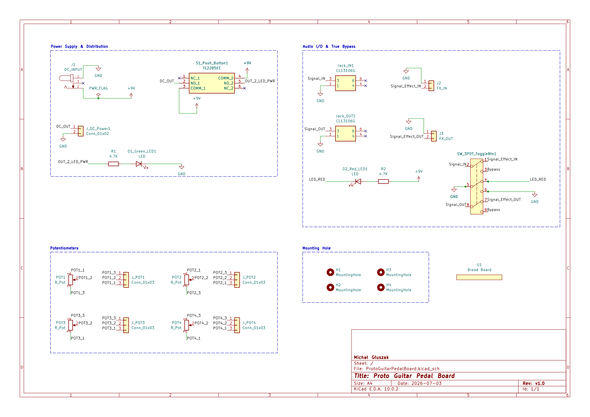
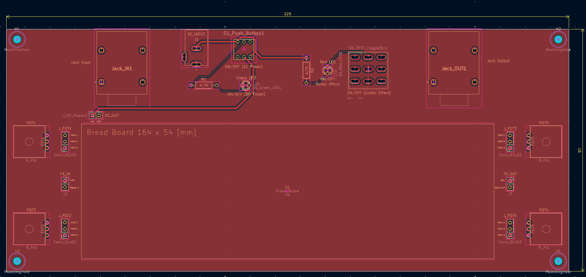
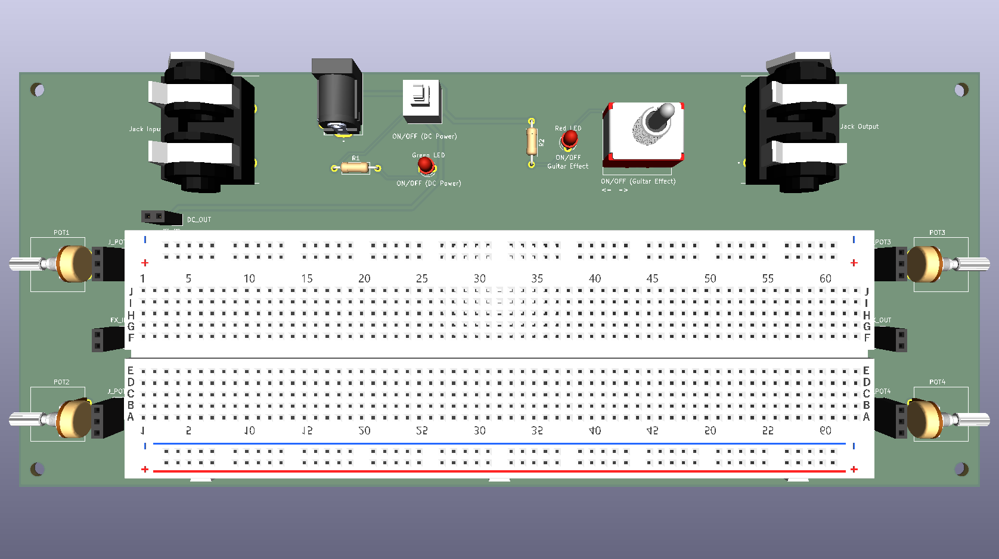

# ProtoGuitarPedalBoard 🎸

**A PCB workstation designed for convenient prototyping and testing of guitar effect circuits.**

* **Software:** Project designed entirely in **KiCad**.

---

## Schematic
* **Circuit Logic:** Clear division into functional blocks (Power Supply, Audio I/O & True Bypass, Potentiometers).

  

---

## PCB Layout
A double-sided printed circuit board designed with a focus on signal separation and assembly clarity.

* **Optimized Routing:** Strict division into dedicated net classes – audio signal tracks (0.3 mm) and thickened power tracks (0.7 mm).
* **Noise Reduction:** Double-sided copper pour (Polygon Pour) applied to provide proper shielding for the analog circuit.

### Top Layer (F.Cu)

  

### Bottom Layer (B.Cu)

  

---

## 3D Visualization
A preview of the assembled testing platform with mechanical components.

  

