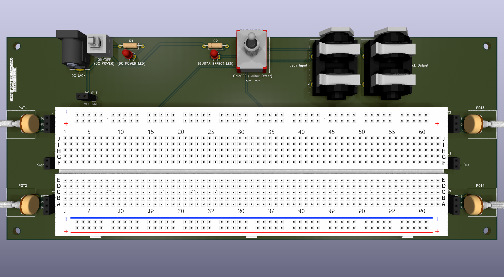
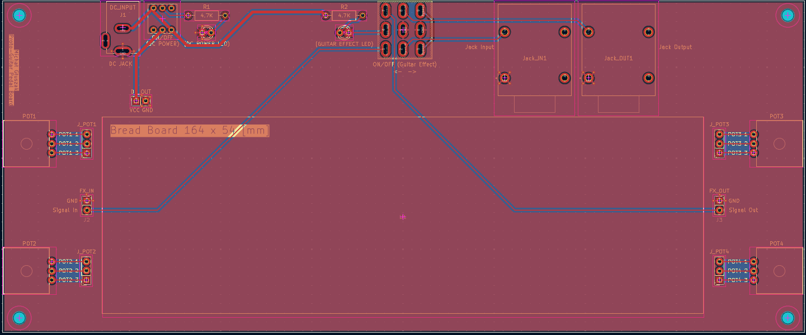
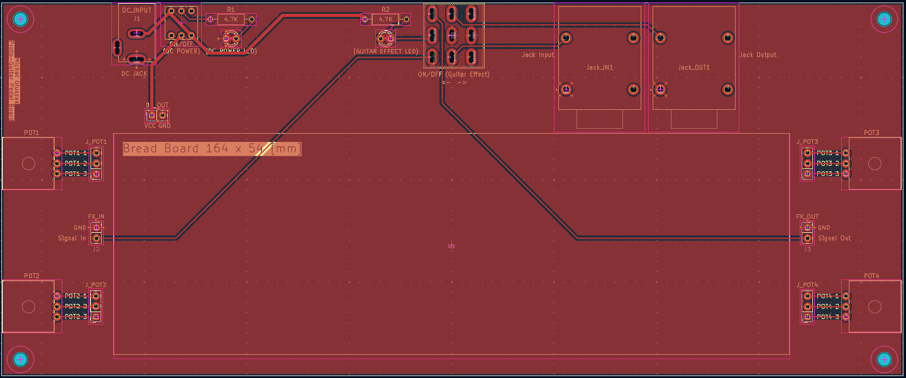
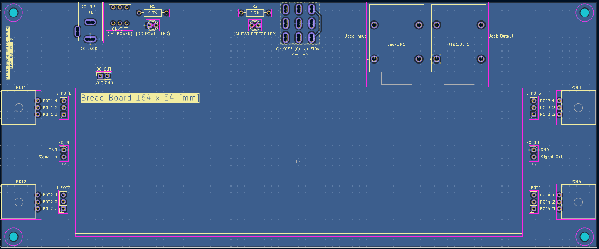

# Proto-Guitar Pedal Board

## About the Project

The **Proto-Guitar Pedal Board** is a universal hardware platform designed specifically for comfortable prototyping and testing of custom guitar effects.

This project was born from my passion for music electronics. My first experience with KiCad was making a clone of the famous ProCo RAT pedal. I enjoyed this process so much that I decided to go a step further and start designing my own circuits at home. Instead of soldering connectors and potentiometers every time, I created a dedicated motherboard that has all the necessary peripherals integrated. Thanks to this, I can focus only on designing the audio circuit on the built-in breadboard.

## Features

* **Breadboard:** A central place measuring 164 x 54 mm, allowing for quick building and modifying of circuits without soldering.
* **Integrated Audio I/O:** 6.3mm Jack sockets for input (guitar) and output (amplifier).
* **Hardware True Bypass:** A built-in 3PDT switch with an LED indicator, providing a classic true bypass.
* **Convenient Power Supply:** A power connector (DC Jack) with a switch and a power status LED. Power pins (VCC, GND) are conveniently placed next to the breadboard.
* **Potentiometer Modules:** 4 built-in potentiometers on the edges of the board. Each has its pins routed to pin headers, which allows for a quick connection to the prototype circuit using jumper wires.

> [!WARNING]  
> **Important Power Supply Note (Polarity):** As is standard for guitar pedals, this board is designed for a **center-negative** power supply (BOSS style). Many standard household AC/DC adapters are center-positive. Connecting a center-positive adapter without checking the polarity can permanently damage your prototype circuits! Always verify your power supply before plugging it in.

## PCB Technical Specifications

While designing the printed circuit board, I used good engineering practices to ensure power stability and minimize noise in the audio signal:

* **Board dimensions:** approx. 220 mm x 95 mm
* **Signal trace width:** 0.3 mm – optimal width ensuring clean routing and easy connection of audio signals between components.
* **Power trace width:** 0.7 mm – increased width to minimize power line impedance and ensure safe current flow to the tested circuits.
* **Ground Planes:** I applied ground planes (GND copper pours) on both layers of the board (Top and Bottom). This provides excellent signal shielding and reduces system noise, which is crucial when designing high-gain guitar effects (e.g., Fuzz, Distortion).
* **Trace Topology:** The vast majority of signal and power traces were routed on the top layer (Top Layer - red). The bottom layer (Bottom Layer - blue) remained mostly untouched and serves almost exclusively as a solid ground plane.

## Schematic

The schematic is divided into logical blocks: power section, audio input/output section (with the bypass switch), and potentiometer section.

## PCB Design

The trace layout was optimized for ease of use and minimization of audio signal noise during the prototyping stage.

**Top Layer:**

**Bottom Layer:**

## Bill of Materials (BOM)

To make the assembly of the motherboard easier, I generated an interactive Bill of Materials (BOM) using the *InteractiveHtmlBom* plugin.

👉 **[Open Interactive BOM](https://michalgluszak.github.io/ProtoGuitarPedalBoard/Documentation/bom/ProtoGuitarPedalBoard_BOM.html)**

---
*Project created in KiCad 10.0.*